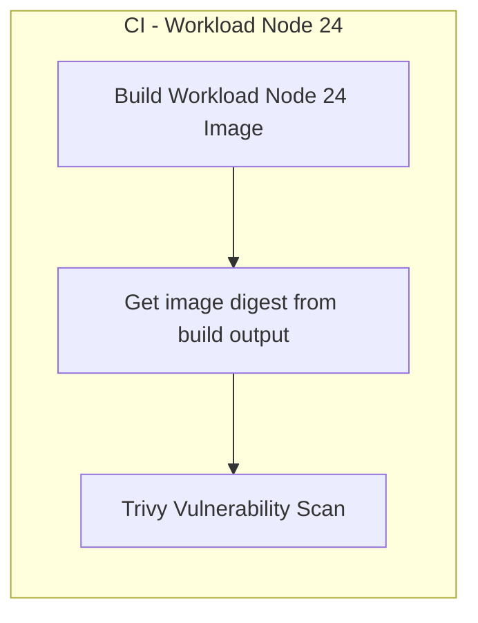
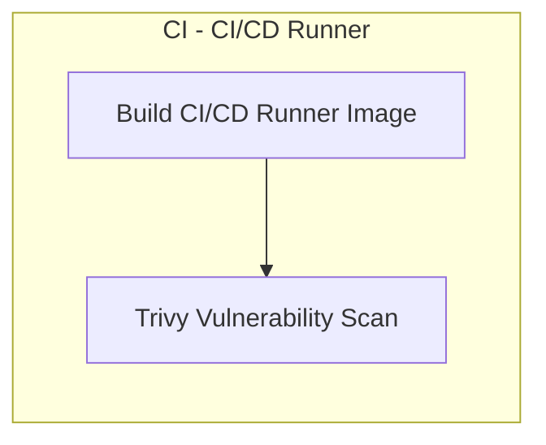

# Digital Step Flow - Base Images

Repositório para imagens base reutilizáveis do Digital Step Flow.

## Imagens base e segurança

Todas as imagens deste repositório são construídas a partir de **imagens base reforçadas (hardened images)** para reduzir a superfície de ataque e aumentar a confiabilidade da aplicação. A imagem base utilizada é o [Alpine Base](https://hub.docker.com/hardened-images/catalog/dhi/alpine-base) do catálogo Docker Hardened Images (`dhi.io/alpine-base`), que oferece uma base Alpine Linux mínima e segura, com suporte a padrões como CIS, FIPS e STIG quando aplicável.

- **Catálogo Docker Hardened Images (Alpine Base):** [hub.docker.com/hardened-images/catalog/dhi/alpine-base](https://hub.docker.com/hardened-images/catalog/dhi/alpine-base)

Os detalhes técnicos de construção, versionamento e publicação estão documentados neste repositório e nos repositórios que consomem essas imagens.

## Estrutura

Este repositório contém duas imagens, ambas derivadas da imagem hardened `dhi.io/alpine-base`:

### 1. Workload Node.js 24 (`workload/node-24/`)

Imagem base para **workloads da aplicação** (backend e frontend):
- **Base:** `dhi.io/alpine-base` (hardened image)
- Node.js v24.13.0
- npm 11.6.3
- Usuário não-root (appuser)

É a imagem utilizada pelos Dockerfiles do backend e do frontend da solução (`FROM raphaelmoraes/digital-step-flow-base-node:...`).

**Imagem Docker:** `raphaelmoraes/digital-step-flow-base-node:<version>` (prod) e `:<version>-dev` (desenvolvimento)

### 2. CI/CD Runner (`cicd-runner/`)

Imagem para **execução de pipelines CI/CD** (ex.: jobs de deploy no GitHub Actions):
- **Base:** `dhi.io/alpine-base` (hardened image)
- Docker CLI, kubectl, kustomize
- GitHub CLI, Trivy, Argo CD CLI
- Git, bash, curl, jq, yq

Contempla as ferramentas necessárias para build, push, atualização de manifests Kubernetes e demais etapas de CI/CD. Os workflows de deploy (backend e frontend) utilizam esta imagem como container dos jobs que atualizam os manifests de dev/prod.

**Imagem Docker:** `raphaelmoraes/digital-step-flow-cicd-runner:<version>`

## Desenvolvimento / Como contribuir

- **Workload Node 24:** altere arquivos em `workload/node-24/` (Dockerfile, docker-bake.hcl). O CI roda apenas quando há mudanças nesse diretório; após o push, a nova imagem é publicada e o Trivy escaneia pelo digest do build.
- **CI/CD Runner:** altere arquivos em `cicd-runner/`. O CI roda apenas quando há mudanças nesse diretório.
- Para testar localmente antes de fazer o push: use os comandos de build abaixo e, se quiser, rode Trivy na imagem local.

## Build

Antes de construir as imagens localmente, faça login no registro da imagem base (as imagens são construídas a partir de `dhi.io/alpine-base`):

```bash
docker login dhi.io
```

Se for fazer push das imagens para Docker Hub, faça login também:

```bash
docker login
```

### Build Individual

```bash
# Build workload Node 24
docker buildx bake -f workload/node-24/docker-bake.hcl --load

# Build CI/CD runner
docker buildx bake -f cicd-runner/docker-bake.hcl --load
```

### Build Todos

```bash
# Build todas as imagens
docker buildx bake -f docker-bake.hcl --load
```

## Versionamento

Este projeto segue [Semantic Versioning 2.0.0](https://semver.org/).

Para criar uma release:
```bash
git tag -a v1.0.0 -m "Release version 1.0.0"
git push origin v1.0.0
```

## GitHub Actions

Este repositório tem **dois pipelines CI** separados, disparados por alterações em caminhos específicos.

### Pipeline: Workload Node 24 (`ci-workload-node24.yml`)

Dispara em **push** e **pull_request** para `main`/`develop` quando há mudanças em `workload/node-24/**`.



| Job | Descrição |
|-----|-----------|
| **Build Workload Node 24 Image** | Determina versão (branch/tag), build e push da imagem base Node 24 (prod e dev) via `docker buildx bake`. O digest é extraído do log de push (evita digest em cache). |
| **Trivy Vulnerability Scan** | Escaneia a imagem pelo digest recém-construído (CRITICAL/HIGH). |

### Pipeline: CI/CD Runner (`ci-cicd-runner.yml`)

Dispara em **push** e **pull_request** para `main`/`develop` quando há mudanças em `cicd-runner/**`.



| Job | Descrição |
|-----|-----------|
| **Build CI/CD Runner Image** | Determina versão, build e push da imagem do runner (Docker, kubectl, Trivy, etc.). |
| **Trivy Vulnerability Scan** | Escaneia a imagem construída (CRITICAL/HIGH). |

### Uso das imagens no desenvolvimento

- **Backend e Frontend** usam a imagem **Workload Node 24** como base nos Dockerfiles (`FROM raphaelmoraes/digital-step-flow-base-node:...`). Ao alterar `workload/node-24/`, o CI deste repositório publica uma nova imagem; depois, atualize a referência da base no backend/frontend se necessário.
- O **CI/CD Runner** é usado nos workflows de CD (deploy) do backend e frontend para atualizar manifests Kubernetes (kustomize, git push).

## Documentação

- [Workload Node.js 24](./workload/node-24/README.md)
- [CI/CD Runner](./cicd-runner/README.md)
